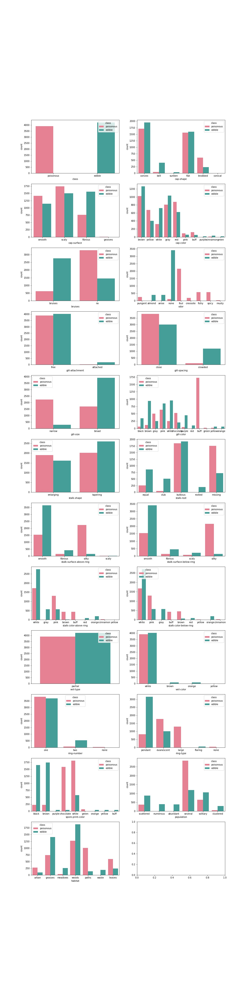

# Mushroom Classification

## Project Overview

Restaurants are looking for a edible mushrooms with 100% accuracy. A single slip up could lead to an ill customer or even a death. This situation must be avoided. That is why recall and specificity are really important. It is important to have high recall, out of all the positive cases a mushroom forager picked out ALL edible ones. The equation for recall is true positive over true positives and false negatives (which are really positive). The equation for specificity is true negative over true negative and false positive (actually negative). It's important to weed all negative cases out so no customers face adverse side effects. We are not worried about making a type 1 error, predicting a mushroom as poisonous when the mushroom is actually edible. A type II error, predicting a mushroom as edible when it is actually poisonous, would be detrimental to a customer.

### The Data

You have the option to either **choose a dataset from a curated list** or **choose your own dataset _not on the list_**. The goal is to choose a dataset appropriate to the type of business problem and/or classification methods that most interests you. It is up to you to define a stakeholder and business problem appropriate to the dataset you choose. If you are feeling overwhelmed or behind, we recommend you choose dataset #2 or #3 from the curated list.

If you choose a dataset from the curated list, **inform your instructor which dataset you chose** and jump right into the project. If you choose your own dataset, **run the dataset and business problem by your instructor for approval** before starting your project.

### Sourcing Your Own Data

Sourcing new data is a valuable skill for data scientists, but it requires a great deal of care. An inappropriate dataset or an unclear business problem can lead you spend a lot of time on a project that delivers underwhelming results. The guidelines below will help you complete a project that demonstrates your ability to engage in the full data science process.

Your dataset must be...

1. **Appropriate for classification.** It should have a categorical outcome or the data needed to engineer one.   

2. **Usable to solve a specific business problem.** This solution must rely on your classification model.

3. **Somewhat complex.** It should contain a minimum of 1000 rows and 10 features.

4. **Unfamiliar.** It can't be one we've already worked with during the course or that is commonly used for demonstration purposes (e.g. MNIST).

5. **Manageable.** Stick to datasets that you can model using the techniques introduced in Phase 3.

Once you've sourced your own dataset and identified the business problem you want to solve with it, you must to **run them by your instructor for approval**.

#### Problem First, or Data First?

There are two ways that you can source your own dataset: **_Problem First_** or **_Data First_**. The less time you have to complete the project, the more strongly we recommend a Data First approach to this project.

**_Problem First_**: Start with a problem that you are interested in that you could potentially solve with a classification model. Then look for data that you could use to solve that problem. This approach is high-risk, high-reward: Very rewarding if you are able to solve a problem you are invested in, but frustrating if you end up sinking lots of time in without finding appropriate data. To mitigate the risk, set a firm limit for the amount of time you will allow yourself to look for data before moving on to the Data First approach.

**_Data First_**: Take a look at some of the most popular internet repositories of cool data sets we've listed below. If you find a data set that's particularly interesting for you, then it's totally okay to build your problem around that data set.

There are plenty of amazing places that you can get your data from. We recommend you start looking at data sets in some of these resources first:

* [UCI Machine Learning Datasets Repository](https://archive.ics.uci.edu/ml/datasets.html)
* [Kaggle Datasets](https://www.kaggle.com/datasets)
* [Awesome Datasets Repo on Github](https://github.com/awesomedata/awesome-public-datasets)
* [New York City Open Data Portal](https://opendata.cityofnewyork.us/)
* [Inside AirBNB](http://insideairbnb.com/)

## The Deliverables

There are three deliverables for this project:

* A **GitHub repository**
* A **Jupyter Notebook**
* A **non-technical presentation**

Review the "Project Submission & Review" page in the "Milestones Instructions" topic for instructions on creating and submitting your deliverables. Refer to the rubric associated with this assignment for specifications describing high-quality deliverables.

### Key Points

* **Your deliverables should explicitly address each step of the data science process.** Refer to [the Data Science Process lesson](https://github.com/learn-co-curriculum/dsc-data-science-processes) from Topic 19 for more information about process models you can use.

* **Your Jupyter Notebook should demonstrate an iterative approach to modeling.** This means that you begin with a basic model, evaluate it, and then provide justification for and proceed to a new model. We encourage you to try a bunch of different models: logistic regression, decision trees, or anything else you think would be appropriate.

* **You must choose appropriate classification metrics and use them to evaluate your models.** Choosing the right classification metrics is a key data science skill, and should be informed by data exploration and the business problem itself. You must then use this metric to evaluate your model performance using both training and testing data.

## Getting Started

Create a new repository for your project to get started. We recommend structuring your project repository similar to the structure in [the Phase 1 Project Template](https://github.com/learn-co-curriculum/dsc-project-template). You can do this either by creating a new fork of that repository to work in or by building a new repository from scratch that mimics that structure.

## Project Submission and Review

Review the "Project Submission & Review" page in the "Milestones Instructions" topic to learn how to submit your project and how it will be reviewed. Your project must pass review for you to progress to the next Phase.

## Summary

This project is an opportunity to expand your data science toolkit by evaluating, choosing, and working with new datasets. Spending time up front making sure you have a good dataset for a solvable problem will help avoid the major problems that can sometimes derail data science projects. You've got this!
